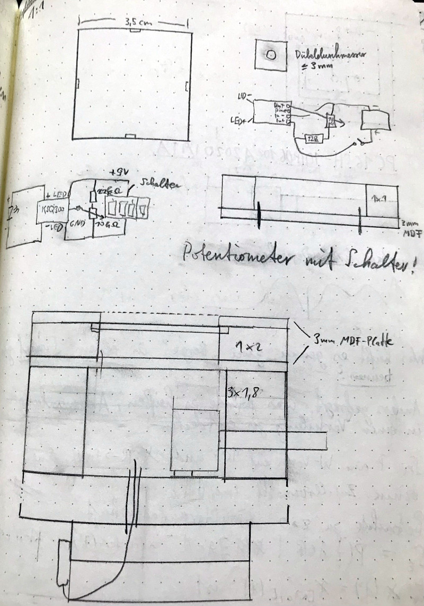
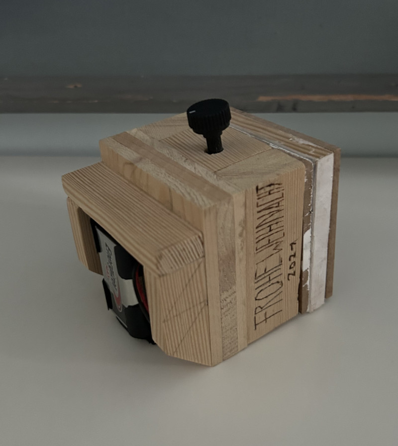
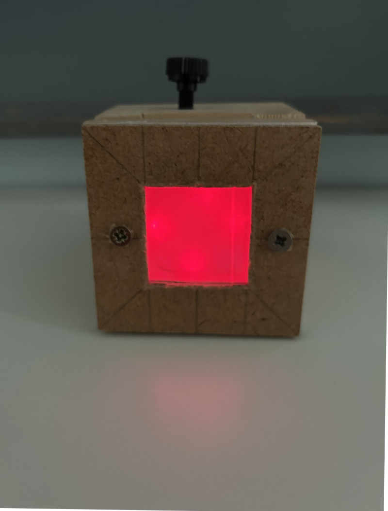

# Hardware-Projekte (Portfolio für R&D/Hardware Engineer)

## Rotlichtprototyp (DIY aus Forschungsartikel)
- **Herausforderung**: Artikel => Fertigprodukt (Schaltung, Gehäuseentwurf und Bau ohne 3D-Drucker).
- **Fähigkeiten**: Optik (Berechnung der photometrischen Beleuchtungsstärke), Schaltungen (KiCAD), Gehäusebau (Holz), vollständige Umsetzung.
- **Relevanz**: Machbarkeitsstudien, Fertigungsentwurf.
- **Artikel**: [Optically Improved Mitochondrial Function Redeems Aged Human Visual Decline](https://pubmed.ncbi.nlm.nih.gov/32596723/)

